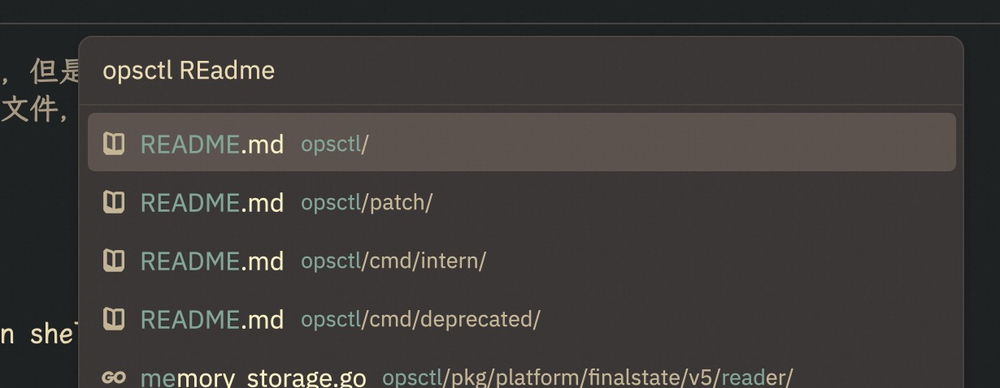

# build

注释 `script/bundle-mac` 文件中 download_git 函数的调用。

修改程序名称：修改 `crates/zed/Cargo.toml` 文件中 `[package.metadata.bundle-dev]` 中 name，由 "Zed Dev" 修改为 "Dev".

# launch

窗口右上角显示资源用量和 GPU FPS 信息（有 bug，可能导致段错误）：

```sh
MTL_HUD_ENABLED=1 /Applications/Zed.app/Contents/MacOS/zed
```

`DEBUG` 启动模式：

```sh
# 先切换到 zed 源码目录(有些命令, 如 ssh remote 会在源码目录编译一些二进制)
$ pwd
/Users/alizj/go/src/github.com/zed-industries/zed
$ RUST_LOG=debug /Applications/Zed\ Dev.app/Contents/MacOS/zed
```

# zed cli

编译 zed 后生成 cli 和 zed 两个 binary，并打包到 Mac 应用中，执行菜单中的 `Install CLI` 命令来更新系统的 zed cli binary。

```sh
zj@a:~$ which zed
/usr/local/bin/zed
zj@a:~$ ls -l /usr/local/bin/zed
lrwxr-xr-x 1 root 44 10 26 14:54 /usr/local/bin/zed -> '/Applications/Zed Dev.app/Contents/MacOS/cli'*
```

使用 zed cli：

```sh
$ zed ~/emacs/minimal.el # 在当前 workspae 中打开文件，但是不将文件添加到 workspace
$ zed -a ~/emacs # 将目录添加到 workspace
```

zed 获得环境变量的方式：
1. 命令行 zed 启动, 继承命令行环境变量;
2. 通过 dock 启动, 先切换到 HOME 目录 spawn 一个 login shell 来获得用户环境变量, 然后被所有 zed 窗口继承;

zed 打开 project 时, 会使用 direnv/editorconfig 等机制来获得项目相关的环境变量, 并被项目的 task/lsp/terminal 继承。

# workspace

快速切换 zed 的多个 window：在 MacOS 的 键盘 -》快捷键 -》键盘 中，设置“将焦点移动到下一个窗口”快捷键：cmd-`

使用 `file finder: toggle` 命令来打开一个项目或文件，会显示一个历史选择列表（Picker）:
- enter：在当前 window 中打开；
- cmd-enter：在新的 window 中打开；

如果历史列表中不存在，则可以 `ctrl-x ctrl-f` 输入文件或目录名，然后按 enter 来打开：
- 如果是目录，则打开**新的 window**，并添加到项目历史记录中；
- 如果是文件，则直接在当前 window 打开，但是**不会**添加到当前 workspace 中，当下次重新打开 workspace 时会**不会包**含对应文件；

如果想在当前 window 中打开文件或目录，而且后续重新打开该 workspace 时还保留，则可以执行 `workspace: add folder to project` 命令将文件或目录添加到 workspace。

对于有多个 project 的 workspace，如果要在某个 project 中搜索文件，则执行 C-x p f 时，可以先输入 project 名称或路径关键字，然后空格，再输入文件名。



一个 window 有多个 panes （通过 spit），一个 pane 有多个 items（tabs）。

pane 有自己的 tool bar 和导航 history（前进、后退）。光标在 Pane buffer 的移动位置会被记录到 Pane 导航历史记录中，可以点击左上角的左、右箭头来回到上一次、下一次的位置。通过使用导航历史快捷键，可以快捷的前后移动。

可以使用 ctrl-0/1/2 等数字快捷键快速在多个 pane tab 切换。

将 project 和 outline panel 都设置到 left dock, 便于查看。

# editing

zed 打开 MacOS 系统文件对话框后，按 `cmd-shift-g` 可以按照文件路径来打开。也可以在终端使用 `zed cli` 来按照文件路径打开文件。

使用 tab switcher 可以快速在当前已经打开的文件间切换，而且默认选择上一次打开的文件。这是最便捷的多文件编辑时切换方式。

设置 `soft wrap` 模式为 `bounded`，且设置较大的 `preferred_line_length` 值，这样不需要人为的为一段话插入物理换行，后续还可以根据 editor 窗口大小自动软换行。

    ``` json
    // 根据 preferred_line_length 或当前 editor 的宽度来自动“软”换行。
    // 软换行：视觉上换行，但是实际文本并没有插入换行字符。
    "soft_wrap": "bounded",
    "preferred_line_length": 120,
    // 在列表中的各宽度位置显示 guide line。
    "wrap_guides": [90, 120],
    ```

在终端中快速打开当前编辑文件对应目录 `workspace::OpenInTerminal`，或者快捷键 `Ctrl-x Ctrl-t`。

在 editor 或 terminal buffer 中，当光标位于文件、目录或带 http/https 的 URL 上时，按 `cmd` 命令可以快速打开。对于目录，会自动添加到当前 workspace 中。也可以选中 URL 的一部分，这样只打开选择部分的 URL。

快速选择一个 block：将光标移动到 block 边界字符上，然后按 `ctrl-=` 来按语法选择。

输入法设置:

1. 不使用 MacOS 内置的拼音输入法，因为它使用中文标点，导致快捷键 ctrl-] 使用中文标点 】，从而与 zed 快捷键绑定不兼容；
2. 使用微信输入法；
3. 启用微信输入法的 shift 中英文切换快捷键。
4. 关闭 “自动编号”；

在 20241121 的 commit [Clip UTF-16 offsets in text for range](https://github.com/zed-industries/zed/pull/20968) 合并后，在开启微信中文输入法的情况下，快捷键绑定中也能使用单字母了。

buffer 和 terminal 都设置为更符合编程体验的 "Sarasa Mono SC" 字体，它是 Iosevka 编程字体的中文版本，名称为等距更纱黑体。

光标位于 URL 上, 执行 editor::open url 命令可以快速打开该 URL。

project panel 默认对空目录进行折叠, 双击折叠的目录时会展开。

editor::Wrap 目前只对 Markdown 和 Plain Text Buffer 类型有效：

```rust
// https://github.com/zed-industries/zed/blob/96683da9f90bad4e1c2778c3607788f3eed31560/crates/editor/src/editor.rs#L7004
if let Some(language_scope) = buffer.language_scope_at(selection.head()) {
    match language_scope.language_name().0.as_ref() {
        "Markdown" | "Plain Text" => {
            should_rewrap = true;
        }
        _ => {}
    }
}
```

安装 org extention 后，可以高亮 org-mode 文件。

配置 `"show_whitespaces": "selection"` 后，显示选择区域中的空格。

`show_completions_on_input vs show_inline_completions`：前者是 LSP 代码补全，后者是大模型补全。

字体：默认使用的是 https://github.com/zed-industries/zed-fonts/tree/zed-plex 字体，需要手动下载安装。

zed plex font 的主要特点是缩小了字体间距，UI 显示的更紧凑。

# multicusor

在编辑窗口（普通编辑窗口或搜索结果窗口），按住 alt 后点击要增加 cursor 的位置，然后就可以多光标同时编辑。

# search

搜索分为 和 project search，支持关键字、word 和正则搜索方式， 也可以忽略大小写。

buffer search 是每输入一个字符就触发的实时增量搜索, 而 project search 是输入完所有搜索字符后按 enter 后才触发搜索。

搜索时，默认选中光标处的 symbol/word，也可以先选中内容后再搜索。

搜索时，默认选中所有匹配项，导致前后跳转时不易分清光标所在行，两个办法：

1. 开启行号来明确显示当前匹配的行；（通过命令面板开启）。
2. 在 outline pane 看当前匹配的行。
3. 焦点切换到编辑窗口（按 tab），按 `ctrl-l` 将光标滚动到窗口中心。

选中搜索框右侧的 `Select All Match` 按钮对当前选中的匹配项（默认选中所有匹配项）启用多光标编辑，实现搜索结果的批量编辑。

搜索的结果可以在 outline panel 显示，实现快速跳转和二次过滤。

project search 的结果默认在 preview tab 中显示（标题是斜体），它是临时 buffer，在其中双击后就显示 对应位置的文件内 容，不能再返回到以前的结果 buffer。 解决办法：双击前，先将该 preview tab pin 住或转换 为普通 tab（双击tab）。

正则搜索使用扩展正则表达式语法, 参考 [regex crate 文档](https://docs.rs/regex/latest/regex/#syntax).

# outline

outline 是基于 tree-sitter 解析的节点树，支持对编辑窗口、搜索窗口（buffer 或 project 搜索）、Reference 窗口、诊断窗口的结构化显示。包含三种类型：

- buffer outline
- project outline
- outline panel

outline panel 支持多种快捷操作（Actions），如目录的展开和合并，跳转到上一级，在 Finder 中打开文件等。

关闭在 outline-panel 显示 markdown、org-mode 中代码块的功能：

1. org-mode：

``` sh
zj@a:~/Library/Application Support/Zed/extensions/installed/org/languages/org$ cat injections.scm
;(block . name: (expr) parameter: (expr) @language (contents) @content)
```

2. markdown

``` sh
zj@a:~/go/src/github.com/zed-industries/zed$ git diff crates/languages/src/markdown/injections.scm
crates/languages/src/markdown/injections.scm --- Text (4 Scheme parse errors, exceeded DFT_PARSE_ERROR_LIMIT)
1 (fenced_code_block                                             1 ;(fenced_code_block
2   (info_string                                                 2 ;  (info_string
3     (language) @language)                                      3 ;    (language) @language)
4   (code_fence_content) @content)                               4 ;  (code_fence_content) @content)
5                                                                5
6 ((inline) @content                                             6 ((inline) @content
7  (#set! "language" "markdown-inline"))                         7  (#set! "language" "markdown-inline"))
```

# multibuffer

project 级别的 search/reference/diagnose 打开的窗口是 multibuffer 类型。

multibuffer 中的文件位置称为片段（excerpt），支持多光标编辑和保存。

配置 `"double_click_in_multibuffer": "open"` 选项后，双击 multibuffer 片段时，在新的 tab 打开对应文件位置。

# preview tabs

在 project panel 中点击各文件时，默认使用 preview tab 显示，点击其它文件时，
preview tab 会切换显示该文件，从而避免同时打开很多个 tabs，特别适合只读查看文件的情况。

preview tabs 的 tab 标题是 _斜体显示_ ，从而可以和普通独立 tab 区分开来。

preview tabs 通过以下方式转换为普通独立 tab：

1. project pandel 中双击打开文件；
2. 使用 `project_panel::OpenPermanent` action 打开文件；
3. 编辑文件。
4. pin tab。
5. 双击 tab。
6. 将 tab 拖移到其它 pane。

还可以在配置文件中配置 code nav 和 file finder 使用 preview tabs。

# keybindings

使用命令 `debug: Open Key Context View` 查看当前焦点的 context，触发的按键以及按键匹配情况。

zed 按键绑定（`/.config/zed/keymap.json`）不区分相同按键序列但不同顺序的情况，如`ctrl-cmd-a` 和 `cmd-ctrl-a` 是相同的按键，但 zed 不提示重复的按键绑定。解决办法：使用固定的顺序来写按键，如 `ctrl-cmd-alt-shift`。

统一规划一些前缀快捷键，如 `ctrl-x`, 它们只用于前缀场景，而不单独使用，否则会导致按键响应延迟。（因为 zed 会等待一段时间来接收前缀后续 的按键，当超时后，才认为是致独立绑定语义）。

zed 支持灵活的按键 remap：

- `["workspace::SendKeystrokes", "ctrl-down ctrl-down ctrl-down ctrl-down ctrl-down"]`
- `["workspace::SendKeystrokes", ": task:spawn enter Test Under Cursor enter"]`
- `["task::Spawn", { "task_name": "Example task" }]`
- `["assistant::InlineAssist",{ "prompt": "Build a snake game" }]`

自定义按键绑定覆盖缺省按键绑定，缺省绑定中未覆盖的按键继续有效。所以，如果要确保自己的按键定生效，则可能需要在多个 context 中重复设置。

不是所有 action 在所有 context 中都有效， 如果高优 context 中的按键绑定 action 无效， 则会 fallback 到低优 context 中该按键绑定的 action，以此类推直到第一个有效 action。

例如 `Editor` 和 `Editor && mode == full` 的 context 都定义了 ctrl-o 快捷键，但是后者的 excerpt 只在 multibuffer 中有效，所以 fallback 到 Editor 中的 buffer symbol：

    {
      "context": "Editor && mode == full",
      "bindings": {
        "enter": "editor::Newline",
        "ctrl-enter": "editor::OpenExcerptsSplit",
        "ctrl-o": "editor::OpenExcerptsSplit",
        "ctrl-cmd-enter": "editor::OpenExcerpts",
        "ctrl-=": "editor::ExpandExcerpts",
        "ctrl-cmd-]": "assistant::QuoteSelection",
        "ctrl-cmd-[": "assistant::InsertIntoEditor"
      }
    },

同一个上下文可以定义多次，会做 merge。在相同 Context 中，同一个快捷键绑定多次时，后续的绑定生效。

shift- 用于表示大写字母或第二按键，使用时需要注意：

- 对于使用大写字母的按键，需要包含 shift，而不能直接写大写字母，如：
  - "alt-shift-r" ：OK
  - "alt-R"： 错误。

- 对于使用第二按键，需要直接使用第二按键名称，而不能包含 shift，如：
  - "cmd-ctrl-<": OK， "cmd-ctrl-shift-,": 错误。
  - "cmd-%": OK, "cmd-shift-%": 错误，"cmd-shift-5": 错误。

- 对于非大写字母或第二按键的场景，不能使用 shift，即 zed 的 shift 不支持作为通用修饰键来使用，如：
  - "ctrl-shift-,": 不对，因为 , 有第二按键 <，应该直接使用第二按键，而不需要加 shift。
  - "ctrl-shift-=": 不对，因为 = 有第二按键 +，应该直接使用 "ctrl-+"。

- "ctrl-x ^" 中的 ctrl-x 是作为前缀快捷键来使用，那么 ctrl-x 不能再有单独的定义。

窗口是由层次化的 UI 元素节点组成的，节点间有父子、兄弟关系，处于不同层次的上下文中。 反映到按键上，就是有优先级，嵌套越深的层次上定义的快捷键优先级越高，如 buffer 搜索输入框的层次是：

    Workspace > Pane > BufferSearchBar > Editor(搜索框)

zed 从配置中加载所有按键绑定，然后用户输入对应按键绑定时，过滤 context 条件符合要求的 actions 列表，然后根据 context 所在的 UI 节点深度，选择最深层次上定义的 action。

当没有打开的文件时，即没有 panel tab 处于 focus 时，处于 Workspace 或 Global 上下文。

如果光标焦点位于搜索框，则 `BufferSearchBar > Editor context` 定义的快捷键优先级最高，然后是普通 `Editor > BufferSearchBar > Pane > Workspace`。

context 表达式可以使用 > 来表达直接的父子关系（父直属的子节点）匹配，如 Parent > Child，层次越深优先级越高。

context 表达式中的逻辑表达式并不表示层次关系,也没有提升优先级深度，如 `BufferSearchBar && !in_replace` 实际还是匹配焦点位于 BufferSearchBar 中搜索框（而非替换框），由于本质上还是匹配 BufferSearchBar 这一个层次，所以它们的定义顺序很重要，后续的覆盖前者，例如 keymap.json 文件中安如下顺序定义 context：

1. Editor
2. Editor && mode == single_line
3. Editor && mode == full
4. Editor && (showing_code_actions || showing_completions)
5. BufferSearchBar && !in_replace > Editor

第 1 个 Editor 由于没有限定条件，是 Editor 的通用配置，所以应该放到最前面。

第 2、3 个 Editor 都是匹配特定 mode 的 context，只会在对应的场景下生效，但它们的并没有引入优先级更深的 cotext，本质上还是和第 1 个处于相同的深度，但是由于位于 Editor 的后面定义，所以覆盖 Editor 中相同定义的快捷键。

按键绑定优先级：Editor 》Pane 》Workspace 》Global。

Workspace 优先级比 Editor、Pane、Term 低，但比 Global 高，用于定义全局快捷键。

类似于下面两个父子上下文，匹配的是 BufferSearchBar 中包含的下一个 single_line mode 的 Editor 输入框和替换框，所以它引入了更高优先级的嵌套深度，高于 BufferSearchBar 和普通 Editor 上下文：

- "context": "BufferSearchBar && !in_replace > Editor" // Search 输入框
- "context": "BufferSearchBar && in_replace > Editor" // InReplace 输入框

各上下文可以调用任意命令（action），但是不是所有 action 在所有 context 中都生效，当它不生效时会 fallback 到以前的 action。

gpui::actions!() 和 impl_actions!() 宏定义了各种命令面板中的命令，如：
https://github.com/zed-industries/zed/blob/92c29be74cc2ac09dfe0d71d5a1048121b6ab4c6/crates/editor/src/actions.rs#L156

keymap 的 context 除了 > 外，并不不表示层次关系，或有衔接关系，而只是用于将当前节点的 identify 与条件进行匹配。

- https://github.com/zed-industries/zed/blob/d209eab05879ddd49c4ebbb439966150f7c3b686/crates/workspace/src/workspace.rs#L4706
- https://github.com/zed-industries/zed/blob/d209eab05879ddd49c4ebbb439966150f7c3b686/crates/gpui/src/keymap.rs#L78
- https://github.com/zed-industries/zed/issues/14718
- https://github.com/zed-industries/zed/blob/92c29be74cc2ac09dfe0d71d5a1048121b6ab4c6/crates/gpui/src/keymap/context.rs#L99
- https://github.com/zed-industries/zed/blob/92c29be74cc2ac09dfe0d71d5a1048121b6ab4c6/crates/gpui/src/elements/div.rs#L550

通过查看 keymap context 的 add 和 set 方法的引用，以及 div 和 key_context 方法，可以获得所有 context 信息。

直接设置的 key context 如下：

- AssistantPanel
- ContextEditor # 是 assistant 在用的上下文。
- GiveFeedback
- menu # 位于 ContextMenu 中，ContextMenu 是可以选择列表中项目的组件。
- ChatPanel
- PasswordPrompt # ssh
- PromptLibrary
- DevServerModal
- CollabPanel
- PromptEditor # LLM inline assistant
- TabSwitcher：ctrl-tab 显示的 tab 切换
- Picker：项目文件或符号选择（列表）

[os](https://github.com/zed-industries/zed/blob/92c29be74cc2ac09dfe0d71d5a1048121b6ab4c6/crates/gpui/src/keymap/context.rs#L32)

- os == macos/linux/windows

[Editor](https://github.com/zed-industries/zed/blob/92c29be74cc2ac09dfe0d71d5a1048121b6ab4c6/crates/editor/src/editor.rs#L2106)

- mode == single_line/auto_height/full
- jupyter
- renaming # 执行标识符重命名时，提示输入新名称
- menu && showing_completions # 出现上下文补全时
- menu && showing_code_actions # 出现上下文 codeaction 时
- extension == xx # 出现 extension 时
- inline_completion && copilot_suggestion # 出现 inline 智能补全

编辑窗口或输入框（如 search、replace、filter、rename 等输入框）中的按键绑定。焦点位于编辑或输入框时有效，位于终端等窗口类型无效。优先级比 workspace 和 pane 高。

Editor 有三种模式 mode:

1. SingleLine：如 editor::rename, TextField(如 search input，form fields 等)，GotoLine，Outline Panel 的 Search/Filter 输入框，Picker 输入框，Buffer 和 Project Search Editor。
2. AutoHeight：inline assistant，terminal inline assistant，chat panel
3. Full：绝大部分编辑场景，如占据整个 pane tab 的编辑窗口；

单行输入框上下文，例如搜索框、替换框、过滤框等，可以用 Editor && mode== single_line 匹配。

编辑普通文件、编辑 assistant/multibuffer 时 mode == full。

keymap 的 context 中使用逻辑表达式来匹配特定模式的 Editor：

1. Editor && mode == full
2. Editor && mode == auto_height

[Dock](https://github.com/zed-industries/zed/blob/92c29be74cc2ac09dfe0d71d5a1048121b6ab4c6/crates/workspace/src/dock.rs#L592)

- Dock Left、Right、Bottom 三种类型

[Pane](https://github.com/zed-industries/zed/blob/d209eab05879ddd49c4ebbb439966150f7c3b686/crates/workspace/src/pane.rs#L2566)

- EmptyPane # 没有任何 active 的 item（tab）

[ProjectPanel](https://github.com/zed-industries/zed/blob/d209eab05879ddd49c4ebbb439966150f7c3b686/crates/project_panel/src/project_panel.rs#L2712)

- menu
- editing # file name 输入框获得焦点
- not_editing

[BufferSearch](https://github.com/zed-industries/zed/blob/d209eab05879ddd49c4ebbb439966150f7c3b686/crates/search/src/buffer_search.rs#L191)

- in_replace # 光标位于 repalce editor 中

[BufferSearchBar](https://github.com/zed-industries/zed/blob/92c29be74cc2ac09dfe0d71d5a1048121b6ab4c6/crates/search/src/buffer_search.rs#L191)

- in_replace # 焦点是否位于替换框中

[ProjectSearchBar](https://github.com/zed-industries/zed/blob/d209eab05879ddd49c4ebbb439966150f7c3b686/crates/search/src/project_search.rs#L1865)

- in_replace # 光标位于 repalce editor 中

[OutlinePanel](https://github.com/zed-industries/zed/blob/d209eab05879ddd49c4ebbb439966150f7c3b686/crates/outline_panel/src/outline_panel.rs#L726)

- menu
- editing # 焦点处于 Filter 输入框
- not_editing # 焦点在 Filter 输入框外

[Vim](https://github.com/zed-industries/zed/blob/d209eab05879ddd49c4ebbb439966150f7c3b686/crates/vim/src/vim.rs#L612)

- vim_mode == VimControl 等等
- vim_operator == x

[Terminal](https://github.com/zed-industries/zed/blob/d209eab05879ddd49c4ebbb439966150f7c3b686/crates/terminal_view/src/terminal_view.rs#L552)

- screen == alt/normal
- mouse_reporting=click/drag/off/motion
- mouse_format=utf8/normal/sgr

[Markdown](https://github.com/zed-industries/zed/blob/d209eab05879ddd49c4ebbb439966150f7c3b686/crates/markdown/src/markdown.rs#L761)

- 渲染的 markdown 窗口。

查看各 zed crate 实现的 Render trait。以 Picker 的 Render 实现为例:

1. key_context("Picker) 定义了该元素 Node 的 context;
2. on_action() 定义了该 Node 监听的按键绑定;(非监听的按键不做处理)
3. children() 指定下一级元素 Node, 这里为 Editor;

所以在 keymap 配置中 Picker 有两个上下文:

1. Picker
2. Picker > Editor

某些 context 的 action 不能用在其它 context 中, context 的可用 action 是由对应 crate module 通过 actions!() 和 impl_actions!() 宏来定义和暴露给命令面板和按键绑定使用的, 例如:

    picker, [ConfirmCompletion]);
    impl_actions!(picker, [ConfirmInput]);

    // crates/picker/src/picker.rs
    impl<D: PickerDelegate> Render for Picker<D> {
        fn render(&mut self, cx: &mut ViewContext<Self>) -> impl IntoElement {
            let editor_position = self.delegate.editor_position();

            v_flex()
                .key_context("Picker")
                .size_full()
                //...
                .on_action(cx.listener(Self::select_next))
                .on_action(cx.listener(Self::select_prev))
                .on_action(cx.listener(Self::select_first))
                .on_action(cx.listener(Self::select_last))
                .on_action(cx.listener(Self::cancel))
                .on_action(cx.listener(Self::confirm))
                .on_action(cx.listener(Self::secondary_confirm))
                .on_action(cx.listener(Self::confirm_completion))
                .on_action(cx.listener(Self::confirm_input))
                .children(match &self.head {
                    Head::Editor(editor) => {
                        if editor_position == PickerEditorPosition::Start {
                            Some(self.delegate.render_editor(&editor.clone(), cx))
                        } else {
                            None
                        }
                    }
                    Head::Empty(empty_head) => Some(div().child(empty_head.clone())),
                })
                // ...
                .children(self.delegate.render_footer(cx))
                .children(match &self.head {
                    Head::Editor(editor) => {
                        if editor_position == PickerEditorPosition::End {
                            Some(self.delegate.render_editor(&editor.clone(), cx))
                        } else {
                            None
                        }
                    }
                    Head::Empty(empty_head) => Some(div().child(empty_head.clone())),
                })
        }
    }

# language

zed server 运行过程中，会自动[从网络下载 lsp language 并安装](https://github.com/zed-industries/zed/blob/f919fa92de1d73c492282084b96249b492732f83/crates/languages/src/rust.rs#L100) 到 `~/.local/share/zed/languages/` 目录下：

``` sh
zj@a:~/Library/Application Support/Zed$ pwd
/Users/alizj/Library/Application Support/Zed
zj@a:~/Library/Application Support/Zed$ ls
copilot/  db/  docs/  extensions/  languages/  node/  prettier/  remote_servers/
zj@a:~/Library/Application Support/Zed$ ls extensions/installed/
basher/      csv/  dockerfile/  html/  intellij-newui-theme/  log/   new-darcula/   org/   snippets/  toml/
catppuccin/  cue/  elisp/       ini/   latex/                 make/  one-dark-pro/  scss/  sql/       xml/
zj@a:~/Library/Application Support/Zed$ ls languages/
cargo-appraiser-v0.0.17/  json-language-server/    pylsp/    rust-analyzer/                vscode-css-language-server/  yaml-language-server/
eslint/                   package-version-server/  pyright/  tailwindcss-language-server/  vtsls/
zj@a:~/Library/Application Support/Zed$ ls languages/pylsp/pylsp-venv/bin/
Activate.ps1  activate  activate.csh  activate.fish  pip*  pip3*  pip3.12*  python@  python3@  python3.12@
zj@a:~/Library/Application Support/Zed$ ls prettier/
node_modules/  package-lock.json  package.json  prettier_server.js
zj@a:~/Library/Application Support/Zed$ ls remote_servers/
dev/  preview/
zj@a:~/Library/Application Support/Zed$ ls remote_servers/dev/
linux-aarch64/
zj@a:~/Library/Application Support/Zed$ ls remote_servers/dev/linux-aarch64/0.160.0.gz
```

本地安装的扩展、LSP Server、Remote binary 等位于 `~/Library/Application Support/Zed/` 目录下：

```sh
$ ls ~/Library/Application\ Support/Zed/
copilot/  db/  docs/  extensions/  languages/  node/  prettier/  remote_servers/

$ ls ~/Library/Application\ Support/Zed/languages/
eslint/  json-language-server/  package-version-server/  pyright/  rust-analyzer/  tailwindcss-language-server/  vscode-css-language-server/  vtsls/  yaml-language-server/
```

使用 `file_types` 参数为扩展名或文件路径指定语言类型:

    "file_types": {
      "C++": ["c"],
      "TOML": ["MyLockFile"],
      "Dockerfile": ["Dockerfile*"],
      "JSONC": [
        "**/*.json" // 所有 JSON 文件均使用 jsonc
      ]
    },

zed 支持 by 语言参数[参数列表](https://zed.dev/docs/configuring-languages#language-specific-settings)

    "languages": {
      "Markdown": {
        "tab_size": 2,
        "formatter": "prettier",
        "preferred_line_length": 100,
        "soft_wrap": "preferred_line_length",
        "language_servers": ["intelephense", "!phpactor", "..."],
        "enable_language_server": false  // 是否开启 language server,
        // "format_on_save": "off",
        "format_on_save": {
          "external": {
            "command": "./node_modules/.bin/prettier",
            "arguments": [
              "--ignore-unknown",
              "--stdin-filepath",
              "{buffer_path}"
            ]
          }
        }
      }
    }

各 language server 可以在 lsp 中配置: 配置项名称使用嵌套对象而非 dot 分割字符串, 实例：

    "lsp": {
      // key 为 language server 名称。
      "gopls": {
        "binary": {
          "path": "/Users/alizj/go/bin/gopls",
          "arguments": ["-debug=127.0.0.1:9090"]
        },
        "initialization_options": {
          "usePlaceholders": true,
          "env": {
            "GOOS": "linux",
            "GOARCH": "arm64"
          },
          "buildFlags": ["-tags=debug"],
          "completeUnimported": true,
          "experimentalPostfixCompletions": true,
          "hints": {
            "assignVariableTypes": false,
            "compositeLiteralFields": false,
            "compositeLiteralTypes": false,
            "rangeVariableTypes": true
          }
        }
      }
    }

## prettier

可以按照语言来指定和配置 prettier 的参数。同时在项目的根目录下，添加 prettier 使用的配置文件：
1. .prettierignore
2. .prettierrc 或 .editorconfig


## python

内置支持两个 language server：

- pyright（默认）
- pylsp

安装 pyright lsp server：

```sh
# 建议：微软官方提供的安装方式
sudo npm install -g pyright
# 社区维护的安装方式
# pip install pyright
```

配置 zed 使用自定义安装的 pyright：

```json，
"pyright": {
  "binary": {
  "path": "/opt/homebrew/bin/pyright-langserver",
  "arguments": ["--stdio"]
  }
},
```

## rust

对于大型项目，为了避免每次保存文件都触发 rust-analyzer check 影响性能，可以 by 项目做如下配置：

    {
      "lsp": {
        "rust-analyzer": {
          "initialization_options": {
            // 从 rust-analyzer 获得更多的诊断信息（因为后续关闭了cargo check 检查）。
            "diagnostics": {
              "experimental": {
                "enable": true
              }
            },
            // 关闭 checkOnSave 后，rust-analyzer 将不再运行 cargo check 命令，而只运行 rust-analyzer
            // 自身的检查。下面的 check、cargo 配置都将失效。
            // 如果想运行默认的检查，可以执行 zed 自动为 rust 项目生成的 task：argo check --workspace --all-targets
            "checkOnSave": false,
            // 默认 cargo check --workspace --all-targets，影响性能，关闭 --workspace 和 --all-targets。
            "check": {
              "command": "clippy",
              "workspace": false
            },
            "cargo": {
              "allTargets": false
            }
          }
        }
      }
    }

由于 zed 自动为 rust 生成 task，可以手动执行 task：`cargo check --workspace --all-targets` 来实现 checkOnSave 的效果。

在浏览器打开符号本地文档：

1. 先使用 cargo doc 生成本地文档，否则后续打开的是 https://crates.io/ 的在线文档；
2. 执行命令：`"editor::OpenDocs"`；

显示 RA 的启动信息：

1. 在 ~/.bashrc 中添加环境变了：`export RA_LOG=info`;
2. 实际测试，在 project 中添加 .envrc 以及在 settings.json 中设置该变量都不会生效；
3. 即使设置为 info 级别，RA 也会打印大量日志，*影响性能*，所以日常不能开启；

# task

支持全局或项目级别的任务模板（task template）定义, 全局任务模板保存到 `~/.config/zed/tasks.json` 文件中。

zed 也会自动根据项目语言生成一些 task，如对于 rust 项目，自动生成如下 task（-p xx yy 根据当前正编辑的文件而变化）：

- cargo check -p anthropic
- cargo test -p collab ids -- --nocapture
- cargo test -p collab db
- cargo check --workspace --all-targets # 执行 rust-analyzer 的 checkOnSave 的完整检查。
- cargo clean
- cargo run

任务模板可以使用变量（[列表](https://zed.dev/docs/tasks)）来获得文件/位置/选中的内容等信息, 变量支持缺省值 `${ZED_FILE:default_value}`， 它们可以在 cwd, args 和 label 中使用。

env 字段指定添加到 task 的环境变量，不支持变量替换，优先级高，会覆盖 terminal 环境变量。

zed 使用 terminal shell 来执行 task 命令 `bash -i -c 'xxx'`。

注意：

1. 不支持物理换行，即使前面加 \ 转义字符也不行；
2. cwd 和 env 不支持 shell 扩展，如不能使用 ~ 字符；
3. 字符串支持 \ 转义，如果要把转义字符传给 shell，需要连用 \\;

例子：

    [
      {
        "label": "clippy", // 显示到 modal 的项目名称
        "command": "./script/clippy",
        "args": [],
        "allow_concurrent_runs": true, // 是否可以并发运行
        "use_new_terminal": false
      },
      {
        "label": "cargo run --profile release-fast",
        "command": "cargo",
        "args": ["run", "--profile", "release-fast"],
        "allow_concurrent_runs": true,
        "use_new_terminal": false
      }
    ]

执行任务：

    {
      "context": "Workspace && !Terminal",
      "bindings": {
        "ctrl-t": "task::Spawn",
        "ctrl-cmd-t": "task::Rerun" // 快速执行上次的任务
      }
    }

执行 `task::Spawn` 时，按 tab 选中候选者来修改 task 的命令和参数，也可以输入 *任意 shell 命令和参数* , 然后执行 (具体按键取决于 `picker::ConfirmInput` 中的配置。)：

- oneshot task："alt-enter"，会记录到 task history 中, 后续可以 task:rerun；
- Ephemeral task："cmd-alt-enter"，不会记录到 task history 中；

      ```json
      {
        "context": "Picker > Editor",
        "bindings": {
          // 选中候选者。如果焦点位于 task::Spawn 面板，则会在输入框中填写候选者命令配置, 可以修改它。
          "tab": "picker::ConfirmCompletion",

          // picker::ConfirmInput 目前（20241124）只在 task ui 中使用，下面两个命令也是专门为执行 task 定制的。
          // 不能绑定到 ctrl-enter/cmd-enter，否则会 break 其它使用 Picker Editor 的场景，如 file finder，
          // 它们使用 menu::SecondaryConfirm 而非 picker::ConfirmInput 命令。

          // 1. 执行 oneshot shell 命令，记录到 task history 中，后续可以执行 task: rerun 来重新执行。
          "alt-enter": ["picker::ConfirmInput", { "secondary": false }],
          // 2. 执行 Ephemeral tasks shell 命令，不会记录到 task history 中。
          "cmd-alt-enter": ["picker::ConfirmInput", { "secondary": true }]
        }
      },
      ```

注意：如果修改了 task 定义，则在 task picker 界面应该选择最下面的任务定义，而不是上面执行过的历史任务，否则最新的定义不生效。

例如, 计算 zed buffer 中选中内容的字符数：执行 `ctrl-t`， 然后输入：`echo "$ZED_SELECTED_TEXT" | wc -c`， 最后执行 `ctrl-enter`。

切换 org-mode src block 语言名称，用来临时解决，解析后的 src block 代码显示在 Outline 的问题：

    ``` json
    // Static tasks configuration.
    //
    [
      {
        "label": "toggle org-mode src block",
        "command": "lines=$(grep 'begin_src rust,' ${ZED_FILE} 2>/dev/null | wc -l); if [[ $lines > 10 ]]; then sed -i  -E -e 's/begin_src ([[:alnum:]]+),/begin_src \\1/g' ${ZED_FILE}; else sed -i -E -e 's/begin_src ([[:alnum:]]+)/begin_src \\1,/g' ${ZED_FILE}; fi",
        "use_new_terminal": false,
        "allow_concurrent_runs": false,
        "reveal": "always",
        "hide": "always",
        "cwd": "/Users/alizj/docs/"
      }
    ]
    ```

快速切换输入法 task：

    ``` json
    {
      // 需要事先安装 macism 命令。
      "label": "switch-input-method",
      "command": "current=$(macism)",
      "args": [
        ";if [[ $current =~ com.sogou.inputmethod.sogou.pinyin ]]; then macism com.apple.keylayout.ABC; else macism com.sogou.inputmethod.sogou.pinyin; fi"
      ],
      "reveal": "never", // 执行时不显示终端
      "use_new_terminal": false, // 复用已有未结束的终端
      "allow_concurrent_runs": true,
      "hide": "always" // 任务结束后自动关闭终端
    }
    ```

绑定到快捷键 shift-shift：

    ``` json
    {
      "context": "Workspace && !Terminal",
      "bindings": {
        "ctrl-t": "task::Spawn",
        // 重新执行上次的 task
        "ctrl-cmd-t": "task::Rerun",
        // 快速切换输入法
        "shift shift": ["task::Spawn", { "task_name": "switch-input-method" }]
      }
    },
    ```

lazygit task：

1. 编辑配置文件 `~/.config/lazygit/config.yml`：

        ```yaml
        gui:
          language: en
        os:
          editPreset: "zed" # 使用 zed 编辑文件
        ```

2. 创建 zed task：需要配置环境变量 `XDG_CONFIG_HOME` 来指定 lazgit 的配置目录。

        ``` json
        {
          "label": "lazygit",
          //"command": "macism com.apple.keylayout.ABC; lazygit",
          "command": "azygit",
          "args": [],
          "env": {
            "XDG_CONFIG_HOME": "/Users/alizj/.config"
          },
          "use_new_terminal": false,
          "allow_concurrent_runs": true,
          "hide": "never",
          "cwd": "${ZED_WORKTREE_ROOT}",
          "show_command": false,
          "show_summary": false
        }
        ```

3. 配置快捷键：
  + 对于 task:Spawn 快捷键打开的终端 task，可以使用 "target": "center" 参数用于控制将终端 pane 全屏显示。

        ``` json
        {
          "context": "Workspace && !Terminal",
          "bindings": {
            "ctrl-t": "task::Spawn",
            // 重新执行上次的 task
            "ctrl-cmd-t": "task::Rerun",
            // 打开 lazygit, "target": "center" 参数用于控制将终端 pane 全屏显示。
            "shift shift": ["task::Spawn", { "task_name": "lazygit", "target": "center" }]
            // 快速切换输入法
            //"shift shift": ["task::Spawn", { "task_name": "switch-input-method" }]
          }
        },
        ```

# assistant

zed 的 claude 3.5 Sonnet 每个账号每月 10 美元额度，超过的需要自己充值。

assistant context editor 和普通 Editor 一样，支持各种编辑模式的按键绑定。但是该 editor 中包含 message block，每个 block 是不同 role 的 container：

- You
- Assistant
- System

可以点击 role 命令来切换类型。

AI 返回的内容使用 Assistant role block 类型。

使用 `assistant: assist` 命令发送当前 context 的内容给 AI。

各个 context 都保存在本地目录中 `~/.config/zed/conversations`，可以清理和修改。

AI 回答过程中可以使用 escape 中断。

可以随时使用 cmd-n 来创建新 context 来创建新的对话。

可以对 context 对话历史就行修改，比如点击 role block，就可以删除 Assistant 的回答。修改 context 历史对话后，token 消耗数量也随之发生变化。

使用 `assistant: quote selection` 命令将普通 Editor 中的选择区域发送到 assistant editor。反之，使用也可以将 Assistant panel 中内容插入到 Editor 中。

Inline Assistant：可以在 Editor 或 Terminal 等任意位置使用 Cmd-Enter 触发 inline Assistant。可以将当前选择内容或当前行发送给 inline Assistant，也可以修改 AI 的响应。

inline assistant 使用当前 assistant panel 的内容作为 context，所以在使用 inline assistant 前，可以将相关信息如 file、selection、diagnose 等发送到 assistant panel。

inline assistant 中不能使用 slash 命令，如 /file ，但是 assistant panel 可以。

支持的 slash 命令：

- /default: Inserts the default prompt into the context
- /diagnostics: Injects errors reported by the project's language server into the context
- /fetch: Fetches the content of a webpage and inserts it into the context
- /file: Inserts a single file or a directory of files into the context
- /now: Inserts the current date and time into the context
- /prompt: Adds a custom-configured prompt to the context (see Prompt Library)
- /symbols: Inserts the current tab's active symbols into the context
- /tab: Inserts the content of the active tab or all open tabs into the context
- /terminal: Inserts a select number of lines of output from the terminal
- /search: Performs semantic search for content in your project based on natural language
  Not generally available yet, but some users may have access to it.
- /workflow: Opts into the edit workflow for a specific context
  Not generally available yet.

部分命令支持参数，如：

- /diagnostics [--include-warnings] [path]
- /file <path>
  - /file src/index.js
  - /file src/\*.js
  - /file src
- /prompt <prompt_name>
- /tab [tab_name|all]
- /terminal [<number>]
  - 指定插入的 output line 数量，默认 50

除了上面内置 slash 命令，也可以通过 extension 机制来添加自定义 slash 命令。

# extentions

extensions 可以扩展：

1. theme
2. language

- meta 信息，如语言名称和扩展名等；
- 基于 tree-sitter 的 syntax grammer highlight
- 提供一个或多个 language server

3. slash command

- 显示在补全列表中，用户选择后执行

extensions 默认被安装到 `~/Library/Application Support/Zed/extensions`。

extensions 使用 Rust 开发，但被编译为 WebAssembly 后被 zed 执行。

实例：

1. [FireCrawl Zed Extension](https://github.com/notpeter/firecrawl-zed)
2. [RFC Zed Extension](https://github.com/notpeter/rfc-zed)
3. [安装 extension 的脚本](https://gist.github.com/srghma/1a53015ed2c26f725119b1c9dc43a3ab)

# snippet

PR: https://github.com/zed-industries/zed/pull/13937

将 Zed 的 snippet 由以前的 snippet extention 支持切换到内部实现，所以不需要安装该扩展和 `snippet-completion-server`。

这个内部实现硬编码了从 `~/.config/zed/snippets` 目录中获得所有 snippet，可以使用命令 `“Snippets: open folder”` 来打开该目录。

该目录下都是 json 文件（不像 simple-snippet-language-server 那样支持目录）：
+ `snippets.json`：定义语言无关的全局 snippets；
+ 其它文件是语言名称相关的 json 文件，如 `org.json`;

另外，zed 实现的 snippet 的 prefix 不能使用 < 开头，如 <e 是不能触发不全的，但是可以使用 _e。

https://github.com/rafamadriz/friendly-snippets 项目提供了丰富的 snippets, 可以将将它 clone 下来后，将 snippets 目录替换 `~/.config/zed/snippets`，同时需要将其中的子目录内容都移动到 `~/.config/zed/snippets` 目录下（可能需要手动合并）。
+ 需要修改 prefix。

``` sh
zj@a:~/.config/zed$ ls snippets/rust/
rust.json  rustdoc.json
zj@a:~/.config/zed/snippets$ mv rust/rust* .
zj@a:~/.config/zed/snippets$ rm -rf rust

zj@a:~/.config/zed/snippets$ ls shell/
shell.json  shelldoc.json
zj@a:~/.config/zed/snippets$ mv shell/* .
zj@a:~/.config/zed/snippets$ rm -rf shell

zj@a:~/.config/zed/snippets$ ls python/
comprehension.json  debug.json  pydoc.json  python.json  unittest.json
zj@a:~/.config/zed/snippets$ cp python/python.json .
```

friendly-snippets 的 org.json 有 bug 需要修复，否则 zed log 中会报 "failed to parse snippet" 错误，同时 snippet 功能失效：
+ https://github.com/zed-industries/zed/issues/21107

``` sh
2024-11-23T17:48:01.660003+08:00 [ERROR] failed to parse snippet

Caused by:
    expected an integer

# 调试代码
crates/snippet/Cargo.toml --- TOML
15 15 [dependencies]
16 16 anyhow.workspace = true
17 17 smallvec.workspace = true
   18 log.workspace = true

crates/snippet/src/snippet.rs --- 1/4 --- Rust
48 55     text: &mut String,
49 56     tabstops: &mut BTreeMap<usize, TabStop>,
50 57 ) -> Result<&'a str> {
.. 58     log::info!("debug parse snippet: {} {}", source, text);
51 59     loop {
52 60         match source
   61             .chars()

# 出问题的地方都是类似于 ${CURRENT_YEAR} 这种不以数字开头的 snippet
zj@a:~/.config/zed/external-snippets/github.com/rafamadriz/friendly-snippets.git$ git diff
snippets/org.json --- JSON
118         "body": [                                                            114     "body": [
119             "#+TITLE:     ${1:Untitled Document}",                           115       "#+TITLE:     ${1:Untitled Document}",
120             "#+AUTHOR:    ${2:Author}",                                      116       "#+AUTHOR:    ${2:Author}",
121             "#+DATE:      ${CURRENT_YEAR}-${CURRENT_MONTH}-${CURRENT_DATE}"  117       "#+DATE:      ${3:CURRENT_YEAR}-${4:CURRENT_MONTH}-${5:CURRENT_DATE}"
122         ]                                                                    118     ]
123     },                                                                       119   },
124     "image": {                                                               120   "image": {

zj@a:~/.config/zed/external-snippets/github.com/rafamadriz/friendly-snippets.git$
```

body 字符串可以使用 \ 对 \$}" 进行转义。

通过 `${1|choice1,choice2,choice3}` 语法支持可选值列表提示。

    ```json
    "Log to the console": {
      "prefix": "log",
      "body": ["console.log($1);", "$0"],
      "description": "Log to the console"
    },
    "my snippet": {
        "prefix": "log",
        "body": ["type ${1|i32, u32|} = $2"],
        "description": "Expand `log` to `console.log()`"
    },
    "my snippet2": {
        "prefix": "snip",
        "body": [
          "type ${1|i,i8,i16,i64,i32|} ${2|test,test_again,test_final|} = $3"
        ],
        "description": "snippet choice tester"
      }
    ```

# markdown

bash/shell code block 需要使用 sh 语言简称, 这样 markdown 才能正确高亮对应 code block。

对于 rust/json 等 tree-sitter 可以支持的 language, 不能使用 code block, 否则 outline 会显示代码的结构。

解决办法: 使用 2 层缩进。

# theme

执行 `debug: open theme preview` 命令预览当前主题的配色。

zed 各主题预览：https://zed-themes.com/?order=recent

几款高质量主题：

1. https://github.com/catppuccin/zed
2. 内置的 Gruvbox Dark Hard

# repl

[Initial Notebook UI structure](https://github.com/zed-industries/zed/pull/19756)

启用方式：
1. 设置 LOCAL_NOTEBOOK_DEV=1；
2. 然后开启一个 workspace(而非单个 ipynb 文件）；

例如:
``` sh
LOCAL_NOTEBOOK_DEV=1 zed ~/
```

后续开发计划大概是下一年年初完善：https://github.com/zed-industries/zed/issues/5273#issuecomment-2486935753

# remote_server

安装 docker desktop。

清理 `~/.docker/config.json` 和 `~/.docker/daemon.json` 中的旧配置。

安装 SOCKS5 转 HTTP 代理：

```sh
zj@a:~/go/src/github.com/zed-industries/zed$ pip3 install pproxy
zj@a:~/go/src/github.com/zed-industries/zed$ pproxy -r socks5://127.0.0.1:1080 -vv
Serving on ipv? 0.0.0.0:8080 by http,socks4,socks5
Serving on ipv? :::8080 by http,socks4,socks5
2024-10-29 12:29:57 Unsupported protocol from 127.0.0.1
```

配置 docker-desktop 使用 HTTP 代理：

1. 配置使用 Host Network 类型；
1. 配置 HTTP 和 HTTPS 代理均为 https://127.0.0.1:8080

修改 zed 项目的 .cargo/config.toml 文件，将 link-arg=-fuse-ld=mold 替换为 link-arg=-B/usr/local/libexec/mold

关闭使用 sccache。

切换到 zed 项目源码目录，手动编译并上传 remote_server binary：

``` sh
# 同构编译
zj@a:~/go/src/github.com/zed-industries/zed$ cargo build --package remote_server --features debug-embed --target-dir target/remote_server

# 交叉编译，生成 aarch64-unknown-linux-gnu 架构的 remote_server binary。
# 需要本地启动支持交叉编译的 docker-desktop。
zj@a:~/go/src/github.com/zed-industries/zed$ cargo install cross --git "https://github.com/cross-rs/cross"
zj@a:~/go/src/github.com/zed-industries/zed$ CROSS_CONTAINER_OPTS="--mount type=bind,src=./target,dst=/app/target" "cross" "build" "--package" "remote_server" "--features" "debug-embed" "--target-dir" "target/remote_server" "--target" "aarch64-unknown-linux-gnu"

zj@a:~/go/src/github.com/zed-industries/zed$ ls target/remote_server/aarch64-unknown-linux-gnu/debug/
build/  deps/  examples/  incremental/  libremote_server.d  libremote_server.rlib  remote_server*  remote_server.d

# 上传到远程服务器的 ~/.zed_server/zed-remote-server-dev-build 位置
zj@a:~/go/src/github.com/zed-industries/zed$ scp target/remote_server/aarch64-unknown-linux-gnu/debug/remote_server dev2:~/.zed_server/zed-remote-server-dev-build
```

启动 zed：
+ dev 模式下需要 unset ZED_BUILD_REMOTE_SERVER 环境变量，否则每次连接远程服务器都会重新编译 remote_server binary。

```sh
zj@a:~$ cd go/src/github.com/zed-industries/zed
zj@a:~/go/src/github.com/zed-industries/zed$ RUST_LOG=debug /Applications/Zed\ Dev.app/Contents/MacOS/zed
```

使用 `projects: open remote` 创建一个 SSH 连接，zed 在没有设置 ZED_BUILD_REMOTE_SERVER 环境变量的情况下，会复用 server 端一有的 ~/.zed_server/zed-remote-server-dev-build binary。

登录目标服务器，可见 `~/.zed_server/zed-remote-server-dev-build` 二进制在运行：

```sh
alizj@lima-dev2:~$ ps aux |grep zed
alizj     288542  0.0  0.0 215088 14720 ?        Ssl  21:04   0:00 .zed_server/zed-remote-server-dev-build proxy --identifier dev-workspace-203
alizj     288545  3.4  0.3 1637268 48148 ?       Sl   21:04   0:00 /home/alizj.linux/.zed_server/zed-remote-server-dev-build run --log-file /home/alizj.linux/.local/share/zed/logs/server-dev-workspace-203.log --pid-file /home/alizj.linux/.local/share/zed/server_state/dev-workspace-203/server.pid --stdin-socket /home/alizj.linux/.local/share/zed/server_state/dev-workspace-203/stdin.sock --stdout-socket /home/alizj.linux/.local/share/zed/server_state/dev-workspace-203/stdout.sock --stderr-socket /home/alizj.linux/.local/share/zed/server_state/dev-workspace-203/stderr.sock
```

同时 zed 在目标服务器上创建和保存了如下文件和目录：

```sh
alizj@lima-dev2:~$ ls ~/.config/zed/
settings.json

alizj@lima-dev2:~$ ls ~/.local/share/
applications  zed

alizj@lima-dev2:~$ ls ~/.local/share/applications/
dev.zed.Zed.desktop

alizj@lima-dev2:~$ ls ~/.local/share/zed/
copilot  db  embeddings  extensions  languages  logs  node  prettier  prompts  server_state  zed-stable.sock

alizj@lima-dev2:~$ ls ~/.local/share/zed/languages/
json-language-server
```

也可以使用命令行打开 zed remote ssh：

- 协议链接：zed://ssh/<connnection>/<path>
- zed 命令：zed ssh://my-host/~/code/zed

本地开发构建使用 `dev profile`，zed 内部会识别当前是否 dev 版本（通过宏 `cfg!(not(debug_assertions))`），会做一些 dev 特殊处理逻辑。

zed 的 ssh_session.rs 的 [update_server_binary_if_needed() 函数](https://github.com/zed-industries/zed/blob/f919fa92de1d73c492282084b96249b492732f83/crates/remote/src/ssh_session.rs#L1735) 会先执行 server 上的 zed-remote-server 的 version 子命令来获得 server 语义版本(current_version)：

```sh
alizj@lima-dev2:~/.zed_server$ ~/.zed_server/zed-remote-server-dev-build version
0.164.0
```

编译时，zed 使用文件 `crates/zed/RELEASE_CHANNEL` 中配置来确定 release channel 类型，可选值为：

- dev
- nightly
- preview
- stable

有一些 zed 特性也是根据 release channel 类型来做不同处理的。例如 ssh_sessions.rs 的
update_server_binary_if_needed() 根据 release channel 来确定需要为 remote server
[安装的版本（wanted_version）](https://github.com/zed-industries/zed/blob/40802d91d4faf849ad35fb53d6b00320c1d04cc1/crates/remote/src/ssh_session.rs#L1760)：

1. 如果是 dev，则设置 wanted_version 为 None，后续进行本地构建；
2. 如果是 nightly、preview、stable，则从 zed.dev API 获得对应版本；

如果执行成功则获得 current_version 值，否则将它设置为 None，则进行版本比较(current_version vs wanted_version)：

1. 如果两者都有值且匹配，则不安装或升级；
1. 如果本地版本低，则提示升级本地 zed 版本后返回；
1. 否则（如 server 版本低，或者有任何一方为 None），则会安装新版本。

在安装新 remote server binary 前，zed 会检查 bianry 是否在使用。如果在使用且 zed 不是 dev 版本，则会直接返回错误，提示 binary 在使用，不能升级。但是如果是 dev 版本，则即使在使用也可以升级。

如果是 dev 模式（wanted_version 为 None）：

1. 先检查环境变量 `ZED_BUILD_REMOTE_SERVER` 是否设置，如果 **未设置** ：
  1. 如果 current_version 有值，则复用 server 端已有的 binary，直接返回；
  2. 如果无值，则报错：ZED_BUILD_REMOTE_SERVER is not set, but no remote server exists
2. 在设置 ZED_BUILD_REMOTE_SERVER 的情况下：
  1. 如果是 dev 模式，则**每次都进行**本地构建和上传到 server；
  2. 否则报错：Running development build in release mode, cannot cross compile
    (unset ZED_BUILD_REMOTE_SERVER)

如果不是 dev 模式，则检查配置参数 upload_binary_over_ssh：

1. 如果为 false（默认），则 server 尝试先从 zed.dev 下载 binary，如果失败则从 zed 本地上传。
2. 如果为 true，则从 zed 本地上传。

从 zed 本地上传：本地 zed 先下载 binary，然后上传到 server。

总结：在 dev 模式下：

1. 如果未设置环境变量 ZED_BUILD_REMOTE_SERVER，则要求远端已经有 `~/.zed_server/zed-remote-server-dev-build` 二进制，**直接复用**，否则报错。
2. 如果设置 ZED_BUILD_REMOTE_SERVER，则每次连接远端时都会进行本地构建和上传。

所以不要在 ~/.bashrc 或为 zed 设置 ZED_BUILD_REMOTE_SERVER 环境变了，而是人工编译并 scp remote_server binary 到远程。

# 交叉编译 remote_server 失败

报错 1：

zj@a:~/go/src/github.com/zed-industries/zed$  CROSS_CONTAINER_OPTS="--mount type=bind,src=./target,dst=/app/target" "cross" "build" "--package" "remote_server" "--features" "debug-embed" "--target-dir" "target/remote_server" "--target" "aarch64-unknown-linux-gnu"
info: downloading component 'rust-src'
info: installing component 'rust-src'
//...
View build details: docker-desktop://dashboard/build/desktop-linux/desktop-linux/eap81oo6osftl6z9tjcqe4h9c

 1 warning found (use docker --debug to expand):
 - InvalidDefaultArgInFrom: Default value for ARG ${CROSS_BASE_IMAGE} results in empty or invalid base image name (line 4)
error: process didn't exit successfully: `/opt/homebrew/bin/sccache rustc -vV` (exit status: 127)

解决方案：

  1. 注释 ~/.cargo/config.toml 文件中

        [build]
        #rustc-wrapper = "/opt/homebrew/bin/sccache"

  2. 注释 ~/.bashrc 中的 export RUSTC_WRAPPER="/opt/homebrew/bin/sccache"

报错 2：

   [2024-10-29T17:14:42+08:00 DEBUG worktree] ignoring event "target/remote_server/debug/incremental/build_script_build-34db12mrzjok5/s-h1avtiisg8-0xfewcx-working" within unloaded directory
   error: linking with `aarch64-linux-gnu-gcc` failed: exit status: 1
   |
   = note: LC_ALL="C" PATH="/Users/alizj/.rustup/toolchains/1.81-x86_64-unknown-linux-gnu/lib/rustlib/x86_64-unknown-linux-gnu/bin:/Users/alizj/.rustup/toolchains/1.81-x86_64-unknown-linux-gnu/lib/rustlib/x86_64-unknown-linux-gnu/bin:/Users/alizj/.rustup/toolchains/1.81-x86_64-unknown-linux-gnu/lib/rustlib/x86_64-unknown-linux-gnu/bin:/usr/local/sbin:/usr/local/bin:/usr/sbin:/usr/bin:/sbin:/bin:/Users/alizj/.rustup/toolchains/1.81-x86_64-unknown-linux-gnu/bin" VSLANG="1033" "aarch64-linux-gnu-gcc" "-Wl,--version-script=/tmp/rustc36YcCI/list" "-Wl,--no-undefined-version" "/tmp/rustc36YcCI/symbols.o" "/target/aarch64-unknown-linux-gnu/debug/deps/zune_jpeg-d98812c935e11704.zune_jpeg.b62aa136303f7057-cgu.00.rcgu.o" "/target/aarch64-unknown-linux-gnu/debug/deps/zune_jpeg-d98812c935e11704.zune_jpeg.b62 "/Users/alizj/.rustup/toolchains/1.81-x86_64-unknown-linux-gnu/lib/rustlib/aarch64-unknown-linux-gnu/lib" "-o" "/target/aarch64-unknown-linux-gnu/debug/deps/libzune_jpeg-d98812c935e11704.so" "-Wl,--gc-sections" "-shared" "-Wl,-soname=libzune_jpeg-d98812c935e11704.so" "-Wl,-z,relro,-z,now" "-nodefaultlibs" "-fuse-ld=mold"
   = note: aarch64-linux-gnu-gcc: error: unrecognized command line option '-fuse-ld=mold'; did you mean '-fuse-ld=gold'?

解决办法：

    修改 zed 项目的 .cargo/config.toml 文件，将 link-arg=-fuse-ld=mold 替换为 link-arg=-B/usr/local/libexec/mold

    该目录下的 ld 是 mold 的软链接，这样 gcc 在使用 ld 时实际使用的是 mold。

    https://github.com/zed-industries/zed/pull/19910

    ``` sh
    zj@a:~/go/src/github.com/zed-industries/zed$ docker run -it localhost/cross-rs/cross-custom-zed:aarch64-unknown-linux-gnu-8d728 bash

    root@b4fce23c85a8:/app# aarch64-linux-gnu-gcc --version
    aarch64-linux-gnu-gcc (Ubuntu 9.4.0-1ubuntu1~20.04.2) 9.4.0
    Copyright (C) 2019 Free Software Foundation, Inc.
    This is free software; see the source for copying conditions. There is NO
    warranty; not even for MERCHANTABILITY or FITNESS FOR A PARTICULAR PURPOSE.

    root@b4fce23c85a8:/app# which mold
    /usr/local/bin/mold
    ```

# 构建 webrtc-sys 失败

- 将 reqwest 升级到最新的 v0.12 版本；
- 启用 reqwest 的 socks feature；

```sh
zj@a:~/go/src/github.com/zed-industries/zed$ ./script/bundle-mac -ldi
~/go/src/github.com/zed-industries/zed/crates/zed ~/go/src/github.com/zed-industries/zed
~/go/src/github.com/zed-industries/zed
Building for local target only.
   Compiling webrtc-sys v0.3.5 (https://github.com/zed-industries/rust-sdks?rev=4262308983646ab5b0e0802c3d8bc52154f99aab#42623089)
error: failed to run custom build command for `webrtc-sys v0.3.5 (https://github.com/zed-industries/rust-sdks?rev=4262308983646ab5b0e0802c3d8bc52154f99aab#42623089)`

Caused by:
  process didn't exit successfully: `/Users/alizj/go/src/github.com/zed-industries/zed/target/debug/build/webrtc-sys-bf3c821455d0b783/build-script-build` (exit status: 101)
  --- stdout
  cargo:rerun-if-env-changed=LK_DEBUG_WEBRTC
  cargo:rerun-if-env-changed=LK_CUSTOM_WEBRTC
  cargo:CXXBRIDGE_PREFIX=webrtc-sys
  cargo:CXXBRIDGE_DIR0=/Users/alizj/go/src/github.com/zed-industries/zed/target/debug/build/webrtc-sys-5584bf7f821ea101/out/cxxbridge/include
  cargo:CXXBRIDGE_DIR1=/Users/alizj/go/src/github.com/zed-industries/zed/target/debug/build/webrtc-sys-5584bf7f821ea101/out/cxxbridge/crate

  --- stderr

  CXX include path:
    /Users/alizj/go/src/github.com/zed-industries/zed/target/debug/build/webrtc-sys-5584bf7f821ea101/out/cxxbridge/include
    /Users/alizj/go/src/github.com/zed-industries/zed/target/debug/build/webrtc-sys-5584bf7f821ea101/out/cxxbridge/crate
  thread 'main' panicked at /Users/alizj/.cargo/git/checkouts/rust-sdks-e9c3cb1fc511908e/4262308/webrtc-sys/build.rs:85:45:
  called `Result::unwrap()` on an `Err` value: reqwest::Error { kind: Request, url: "https://github.com/livekit/client-sdk-rust/releases/download/webrtc-dac8015-5/webrtc-mac-arm64-release.zip", source: hyper_util::client::legacy::Error(Connect, ConnectError("tcp connect error", Os { code: 61, kind: ConnectionRefused, message: "Connection refused" })) }
```

修改 /Users/alizj/.cargo/git/checkouts/rust-sdks-e9c3cb1fc511908e/4262308/webrtc-sys/build/Cargo.toml，使用 0.12 版本，并且添加 socks features：

```tom
[dependencies]
reqwest = { version = "0.12", default-features = false, features = ["rustls-tls-native-roots", "blocking", "socks"] }
```

修改 /Users/alizj/.cargo/git/checkouts/rust-sdks-e9c3cb1fc511908e/4262308/webrtc-sys/build/src/lib.rs 中的 reqwest get 方法，使用 socks5 proxy。

```rust
let mut client = reqwest::blocking::ClientBuilder::new()
    .proxy(reqwest::Proxy::all("socks5h://127.0.0.1:1080")?)
    .build()?;
let mut resp = client.execute(client.get(download_url()).build()?)?;
//let mut resp = reqwest::blocking::get(download_url())?;
if resp.status() != StatusCode::OK {
    return Err(format!("failed to download webrtc: {}", resp.status()).into());
}
```

# 构建 WebRTC 失败

编译 WebRTC 时内部使用 swift build 命令从 github 下载依赖包，所以需要开代理。但它不识别 HTTP/HTTPS 环境变量代理，而是使用 MacOS 系统的全局代理。
+ ali lang 设置的加速代理会报 “An SSL error has occurred and a secure connection to the server ”；

``` sh
zj@a:~/go/src/github.com/zed-industries/zed$ RUST_BACKTRACE=1 ./script/bundle-mac -ldi
~/go/src/github.com/zed-industries/zed/crates/zed ~/go/src/github.com/zed-industries/zed
~/go/src/github.com/zed-industries/zed
Building for local target only.
   Compiling live_kit_client v0.1.0 (/Users/alizj/go/src/github.com/zed-industries/zed/crates/live_kit_client)
error: failed to run custom build command for `live_kit_client v0.1.0 (/Users/alizj/go/src/github.com/zed-industries/zed/crates/live_kit_client)`
note: To improve backtraces for build dependencies, set the CARGO_PROFILE_DEV_BUILD_OVERRIDE_DEBUG=true environment variable to enable debug information generation.

Caused by:
  process didn't exit successfully: `/Users/alizj/go/src/github.com/zed-industries/zed/target/debug/build/live_kit_client-3336570aded05b91/build-script-build` (exit status: 101)
  --- stdout
  cargo:rerun-if-env-changed=MACOSX_DEPLOYMENT_TARGET
  cargo:rerun-if-changed=LiveKitBridge/Sources
  cargo:rerun-if-changed=LiveKitBridge/Package.swift
  cargo:rerun-if-changed=LiveKitBridge/Package.resolved

  --- stderr
  [4257/21811700] Downloading https://github.com/webrtc-sdk/Specs/releases/download/104.5112.17/WebRTC.xcframework.zip
  Downloading binary artifact https://github.com/webrtc-sdk/Specs/releases/download/104.5112.17/WebRTC.xcframework.zip
  error: failed downloading 'https://github.com/webrtc-sdk/Specs/releases/download/104.5112.17/WebRTC.xcframework.zip' which is required by binary target 'WebRTC': downloadError("An SSL error has occurred and a secure connection to the server cannot be made.. Would you like to connect to the server anyway?")
  thread 'main' panicked at crates/live_kit_client/build.rs:80:9:
  Failed to compile swift package in /Users/alizj/go/src/github.com/zed-industries/zed/crates/live_kit_client/LiveKitBridge
  stack backtrace:
     0: rust_begin_unwind
               at /rustc/eeb90cda1969383f56a2637cbd3037bdf598841c/library/std/src/panicking.rs:665:5
     1: core::panicking::panic_fmt
               at /rustc/eeb90cda1969383f56a2637cbd3037bdf598841c/library/core/src/panicking.rs:74:14
     2: build_script_build::build_bridge
     3: build_script_build::main
     4: <fn() as core::ops::function::FnOnce<()>>::call_once
  note: Some details are omitted, run with `RUST_BACKTRACE=full` for a verbose backtrace.
```

解决办法：在网络设置中， 将 代理 -》SOCKS 代理 设置为 127.0.0.1:1080。

``` sh
# 查看系统全局代理，确保没有谁用ali代理，而是使用上面的 1080 代理。
scutil --proxy
```

或者手动下载 zip 包，然后解压到 target/aarch64-apple-darwin/LiveKitBridge_target/artifacts/specs/WebRTC，目解压后的目录名为：WebRTC.xcframework

``` sh
target/aarch64-apple-darwin/LiveKitBridge_target/artifacts/specs/WebRTC
target/aarch64-apple-darwin/LiveKitBridge_target/artifacts/specs/WebRTC/WebRTC.xcframework
target/aarch64-apple-darwin/LiveKitBridge_target/artifacts/specs/WebRTC/WebRTC.xcframework/macos-arm64_x86_64/WebRTC.framework
```

编译后的结果：

```sh
zj@a:~/go/src/github.com/zed-industries/zed$ ls target/debug/WebRTC.framework/
Headers@  Modules@  Resources@  Versions/  WebRTC@

zj@a:~/go/src/github.com/zed-industries/zed$ ls -l target/debug/WebRTC.framework/
total 0
lrwxr-xr-x 1 alizj  24 11  2 11:08 Headers -> Versions/Current/Headers/
lrwxr-xr-x 1 alizj  24 11  2 11:08 Modules -> Versions/Current/Modules/
lrwxr-xr-x 1 alizj  26 11  2 11:08 Resources -> Versions/Current/Resources/
drwxr-xr-x 4 alizj 128 11  2 11:08 Versions/
lrwxr-xr-x 1 alizj  23 11  2 11:08 WebRTC -> Versions/Current/WebRTC*

zj@a:~/go/src/github.com/zed-industries/zed$ ls -l target/debug/WebRTC.framework/Resources/Info.plist
-rw-r--r-- 1 alizj 1018 11  2 11:08 target/debug/WebRTC.framework/Resources/Info.plist
```

编辑生成的 `Info.plist` 文件，在 dict 中添加如下内容：

- 参考：https://github.com/microsoft/vscode/issues/73806#issuecomment-496334904

```xml
<key>NSAppTransportSecurity</key>
   <dict>
       <key>NSAllowsArbitraryLoads</key>
       <true/>
   </dict>
```
